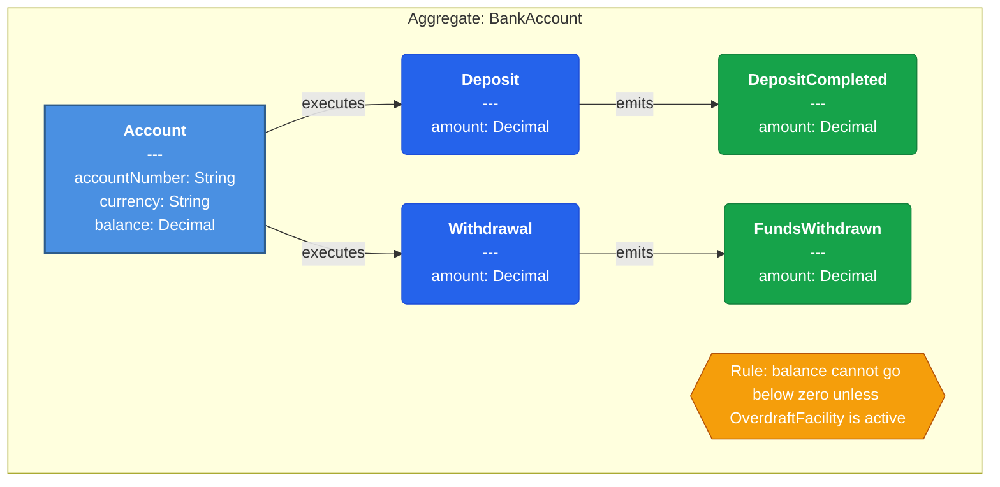
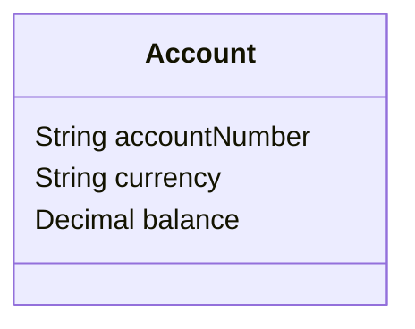
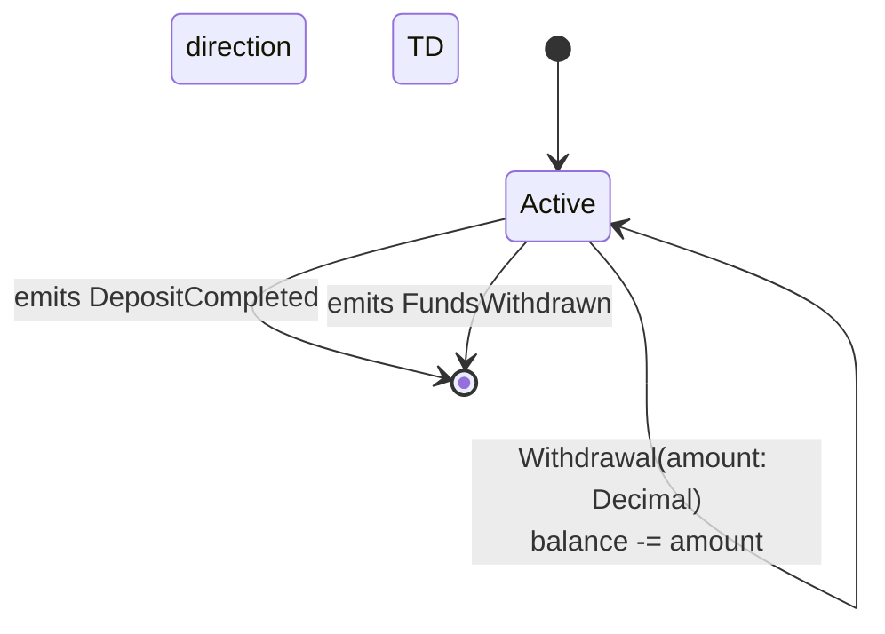

# Domain: RetailBanking

## Architecture Overview

## Aggregate: BankAccount

### Structural View (Class Diagram)

### Behavioral View (State Diagram)

### Visual Contract

#### Invariants
- **[Account]** balance cannot go below zero unless OverdraftFacility is active

#### Commands
- **Deposit** (stateless - no state change) — Actor: Customer — Params: (amount: Decimal)
- **Withdrawal** (stateless - no state change) — Actor: Customer — Params: (amount: Decimal)

#### Domain Events
- **DepositCompleted** (triggered by: Deposit) — Payload: (amount: Decimal)
- **FundsWithdrawn** (triggered by: Withdrawal) — Payload: (amount: Decimal)

---

